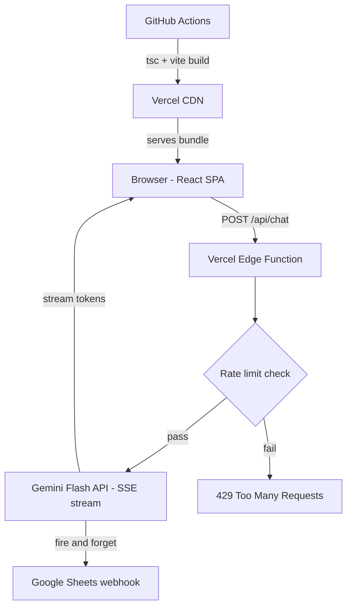

# vansh.dev: Personal Portfolio

[](https://github.com/kiku511/v-blog/actions/workflows/deploy.yml)
[](https://vansh.dev)
[](https://www.typescriptlang.org/)
[](https://react.dev)
[](https://vitejs.dev)

VS Code-themed interactive portfolio. Live at **[vansh.dev](https://vansh.dev)**.

[](https://vansh.dev)

I built this in between jobs as an experiment in 100% vibe coding with light supervision. Just me, Claude, and a rough idea of what a portfolio could look like if it felt like home. The goal wasn't to ship the fastest portfolio; it was to see how far AI-assisted development could take a project end-to-end, from blank canvas to a production site with a real backend, auth-hardened API, observability, and CI/CD. Turns out: pretty far.

---

## Features

**Core experience**
- Faithful VS Code layout: activity bar, resizable sidebar, editor tabs, status bar, minimap, and syntax-highlighted panels that render resume content as real TypeScript source files
- `Cmd/Ctrl+P` command palette, `Cmd/Ctrl+Shift+F` full-text search, and `Cmd/Ctrl+Arrow` tab cycling
- 8 color themes (Dark+, Monokai, Dracula, Nord, GitHub Dark, Solarized, and more), persisted across sessions

**AI Chat**
- Gemini Flash-powered assistant that knows everything about Vansh and nothing else
- Streaming SSE with typewriter effect, per-IP rate limiting, and prompt injection defenses
- Every conversation logged to Google Sheets with geo, user agent, and full Q&A

**Easter eggs & polish**
- Mock terminal (`Ctrl+\``) with easter-egg commands: try `npm install vansh`, `git blame`, or `lucario`
- Konami code (↑↑↓↓←→←→BA) triggers Matrix rain
- Live Ln/Col cursor tracking in the status bar as you hover over code

**Production-grade**
- WCAG AA contrast on every theme, full keyboard navigation, screen reader live regions
- Per-route Open Graph, Twitter Card, JSON-LD `ProfilePage` schema, and canonical URLs
- GitHub Actions type-checks and builds on every push; Vercel deploys to production on merge

---

## Tech Stack

| Layer | Technology |
|-------|-----------|
| Framework | React 19 |
| Language | TypeScript 5.7 |
| Bundler | Vite 6 |
| Routing | React Router 7 |
| Markdown | react-markdown + remark-gfm |
| API runtime | Vercel Edge Functions |
| AI model | Google Gemini Flash (via REST SSE) |
| Logging | Google Sheets (Apps Script webhook) |
| Hosting | Vercel |
| CI | GitHub Actions |

---

## Project Structure

```
vBlog/
├── api/              # Vercel Edge Functions
├── public/           # Static assets (resume PDF, OG image, favicon)
├── src/
│   ├── config/       # Tab definitions and shared constants
│   ├── data/         # Content (profile, themes, search index)
│   ├── hooks/        # useDragResize, useTheme, useMinimapSetting
│   ├── panels/       # One component per editor tab + TerminalPanel
│   ├── components/   # UI shell (ActivityBar, CopilotPanel, CommandPalette, Minimap, etc.)
│   ├── utils/        # Platform utilities
│   └── App.tsx       # Root layout, routing, keyboard handlers, SEO meta
├── index.html
├── vite.config.ts
└── vercel.json
```

---

## Architecture



The entire frontend is a client-side SPA with no server-side rendering. The only backend surface is the single Edge Function at `/api/chat`.

---

## Local Development

### Prerequisites
- Node.js 20+
- [Vercel CLI](https://vercel.com/docs/cli) (`npm i -g vercel`), required to run the Edge Function locally

### Environment variables

| Variable | Required | Description |
|----------|----------|-------------|
| `GEMINI_API_KEY` | Yes | Google Gemini API key |
| `SHEETS_WEBHOOK_URL` | No | Google Apps Script web app URL for chat logging |

Create a `.env` file at the project root (Vercel CLI picks this up automatically):
```
GEMINI_API_KEY=your_key_here
SHEETS_WEBHOOK_URL=https://script.google.com/macros/s/.../exec
```

### Commands

```bash
# Install dependencies
npm install

# Run frontend only (no AI chat, api/chat.ts won't work)
npm run dev

# Run with Edge Function locally (recommended)
npm run dev:vercel

# Type check
npx tsc -b

# Production build
npm run build
```

---

## Deployment

Merging to `main` triggers two things automatically:

1. **GitHub Actions** (`.github/workflows/`) runs `tsc -b && vite build` to validate the build
2. **Vercel** deploys the built SPA and the Edge Function; environment variables are set in the Vercel project dashboard

The `vercel.json` rewrites all non-asset paths to `index.html` to support client-side routing.

---

## Google Sheets Logging Setup

The AI chat logs each conversation turn to a Google Sheet for observability. To enable:

1. Create a Google Sheet with columns: `timestamp`, `ip`, `country`, `city`, `userAgent`, `conversationLength`, `question`, `answer`
2. Open **Extensions → Apps Script** and deploy a web app that appends `POST` body JSON as a new row
3. Set `SHEETS_WEBHOOK_URL` to the deployed web app URL in your Vercel project environment variables
